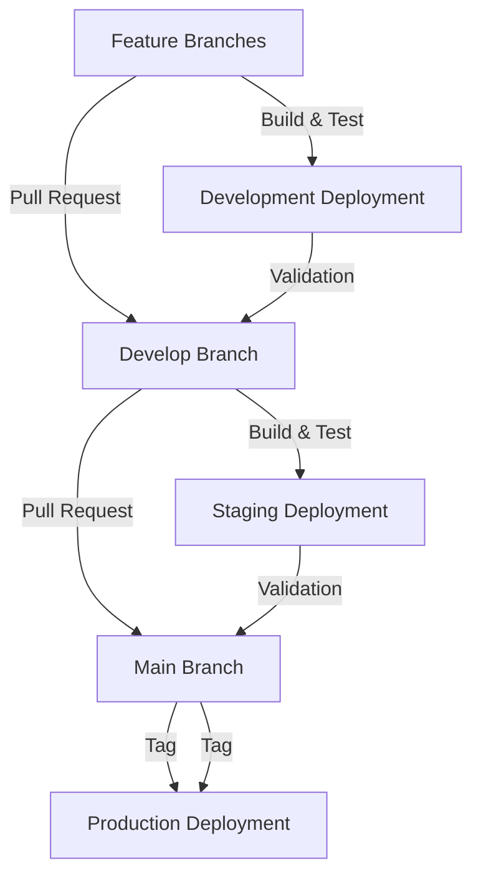

# Deployment Guide

## Introduction

This guide describes how to set up your repository and CI/CD pipeline to build, test, and deploy your project. The project consists of a monorepo structured with Next.js (web), Adonis.js (API backend), and Expo (mobile), hosted on GitHub. Deployment is done on two dedicated Epitech servers, one for development and one for production, each with a fixed IP and a specific host.

## Repository Setup

### Monorepo Structure

The monorepo is organized into four main directories:

- `apps/web`: Contains the Next.js (web) applications.
    
- `apps/api`: Contains the Adonis.js backend.
    
- `apps/mobile`: Contains the Expo (mobile) applications.
    
- `packages/`: Contains shared packages and common logic.
    

This structure allows for code sharing, efficient dependency management, and consistency across different parts of the project. The root `package.json` configures Yarn or PNPM workspaces to manage dependencies and global scripts.

### Metro Configuration for Expo

Expo requires a specific configuration of Metro (the React Native bundler) to work in a monorepo. The `metro.config.js` file is modified to:

- Watch all files in the monorepo (`watchFolders`).
    
- Resolve packages in the correct order (`nodeModulesPaths`).
    
- Manage shared dependencies and avoid version conflicts.
    

## CI/CD Pipeline

### GitHub Actions

The CI/CD pipeline is orchestrated via GitHub Actions, with separate workflows for building, testing, and deployment. Workflows are triggered by Git events (push, pull request, tag creation).

#### Test Workflow

- Install dependencies (`pnpm install`).
    
- Set the cache with `actions/cache@v4`.
    
- Run unit and functional tests (Jest, Japa, Cypress).
    
- Check test coverage (threshold at 80%).
    
- Cache dependencies and artifacts to speed up future runs.
    

#### Build Workflow

- Install dependencies (`pnpm install`).
    
- Build Next.js, Adonis.js, and Expo applications.
    
- Cache dependencies and artifacts to speed up future runs.
    

#### Deployment Workflow

- Deploy to development on the `develop` branch.
    
- Create a preview on pull requests for validation.
    
    - `feature/**` → `develop`
        
    - `develop` → `main`
        
- Deploy to production via a tag on the `main` branch, after manual validation.
    
- Use EAS (Expo Application Services) for Expo builds and updates.
    
- Configure GitHub secrets for Expo tokens and other credentials.
    

### Server Configuration

#### Development Server

- Fixed IP, dedicated host, isolated environment with restricted access.
    
- URLs:
    
    - API: [api.dev.iziclub.fr](http://api.dev.iziclub.fr)
        
    - Web: [web.dev.iziclub.fr](http://web.dev.iziclub.fr)
        
    - Mobile: [mobile.dev.iziclub.fr](http://mobile.dev.iziclub.fr)
        

#### Production Server

- Fixed IP, dedicated host, secure environment with firewall, DMZ, and strict NAT rules.
    
- URLs:
    
    - API: [api.iziclub.fr](http://api.iziclub.fr)
        
    - Web: [iziclub.fr](http://web.iziclub.fr)
        
    - Mobile: [mobile.iziclub.fr](http://mobile.iziclub.fr)
        

### Deployment Process

#### Branching Strategy

- **Feature Branches**: Each new feature is developed in a dedicated branch (`feature/**`).
    
- **Develop Branch**: The `develop` branch is used for integration and testing of features.
    
- **Main Branch**: The `main` branch is used for production releases.
    

#### Pull Requests

- **Feature to Develop**: Pull requests are created from feature branches to the `develop` branch for integration.
    
- **Develop to Main**: Pull requests are created from the `develop` branch to the `main` branch for production releases.
    

#### Tagging

- **Production Tags**: Tags are created on the `main` branch to trigger production deployments.
    

#### Automation

- **GitHub Actions**: Automates the build, test, and deployment processes.
    
- **EAS**: Automates Expo builds and updates.
    

### Diagram

This diagram illustrates the branching strategy and deployment process, showing how features are developed, integrated, and deployed to production.
